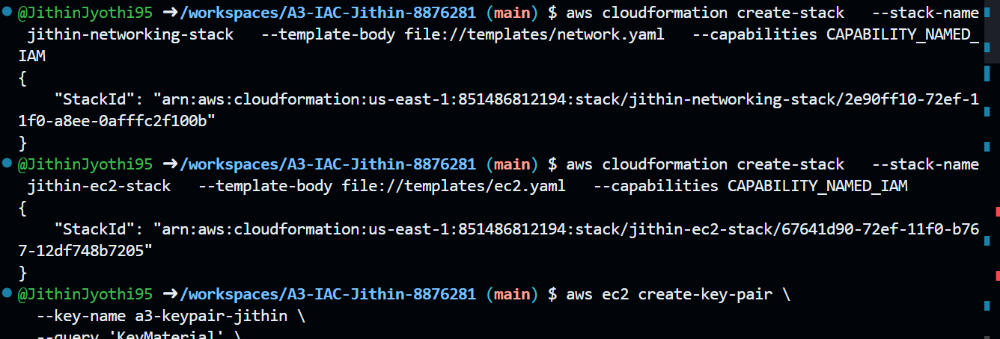

# Assignment 3: Deploying AWS Infrastructure with CloudFormation

---

## Project Overview

This project demonstrates the provisioning of AWS infrastructure using AWS CloudFormation through three separate stacks:

- **Networking Stack**: VPC, subnets, and internet gateway setup
- **RDS Stack**: MySQL RDS instance with security groups and subnet groups
- **EC2 Stack**: Amazon EC2 instance configured in the public subnet

Each component was deployed using a separate YAML template and verified via the AWS Console and CLI.

---

## Folder Structure

```
A3-IAC-JITHIN-8876281/
├── screenshots/                # Contains proof of stack creation and instance visibility
├── templates/                  # CloudFormation YAML templates for each stack
│   ├── ec2.yaml
│   ├── network.yaml
│   └── rds.yaml
├── a3-keypair-jithin.pem       # EC2 SSH key (not uploaded to GitHub)
├── .gitignore                  # To prevent committing sensitive files
├── README.md                   # Assignment summary
```

---

## Deployed Resources

### 1. Networking Stack (`network.yaml`)

- **Stack Name**: `jithin-networking-stack`
- **Resources**: VPC, public/private subnets, route table, internet gateway, outputs
- **Command**:
```bash
aws cloudformation create-stack   --stack-name jithin-networking-stack   --template-body file://templates/network.yaml   --capabilities CAPABILITY_NAMED_IAM
```

**Screenshots**:

  
  
  
  
  


---

### 2. RDS Stack (`rds.yaml`)

- **Stack Name**: `jithin-rds-stack`
- **Resources**: Security Group for MySQL, RDS Instance in private subnet
- **Command**:
```bash
aws cloudformation create-stack   --stack-name jithin-rds-stack   --template-body file://templates/rds.yaml   --capabilities CAPABILITY_NAMED_IAM
```

**Screenshots**:

  
  
  


---

### 3. EC2 Stack (`ec2.yaml`)

- **Stack Name**: `jithin-ec2-stack`
- **Resources**: EC2 instance, security group allowing SSH
- **Command**:
```bash
aws cloudformation create-stack   --stack-name jithin-ec2-stack   --template-body file://templates/ec2.yaml   --capabilities CAPABILITY_NAMED_IAM
```

**Screenshots**:

  
  
  
  


---

## Notes

- The `aws/` folder is excluded via `.gitignore` to avoid committing sensitive CLI configuration.
- The `.pem` key file for EC2 access is retained locally and not pushed to GitHub.

---
## Author

- Student Name: Jithin Jyothi
- Student ID: 8876281  

---
